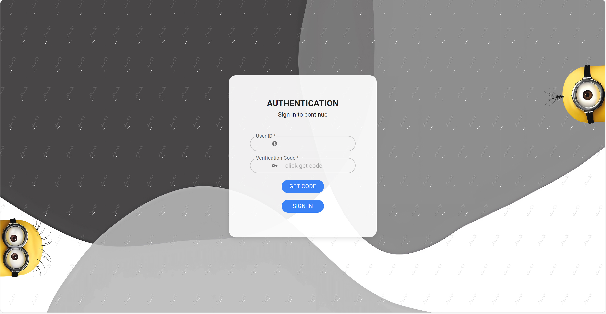
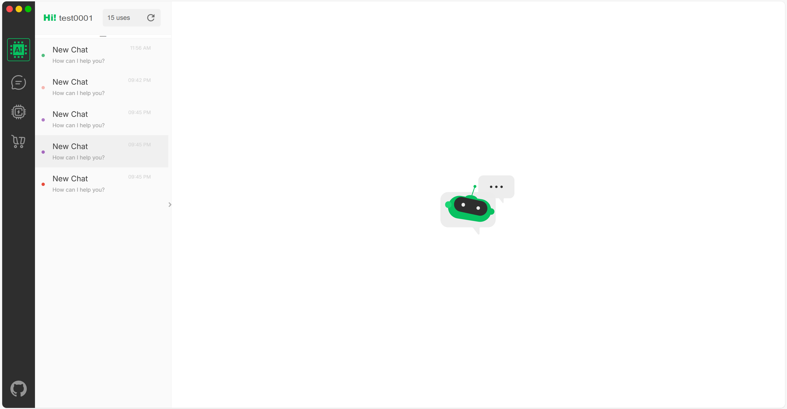
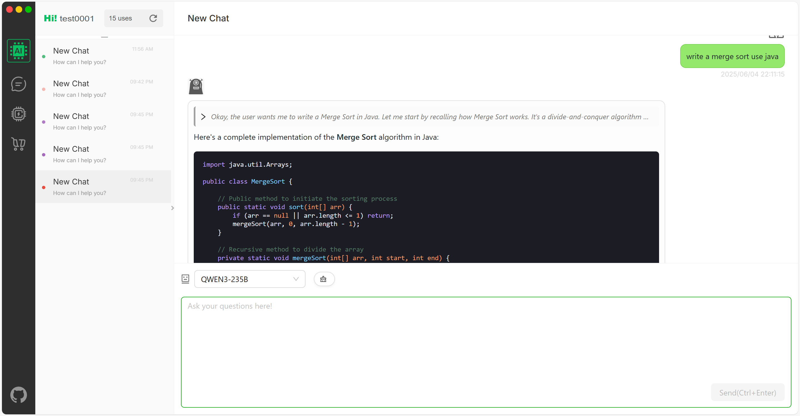
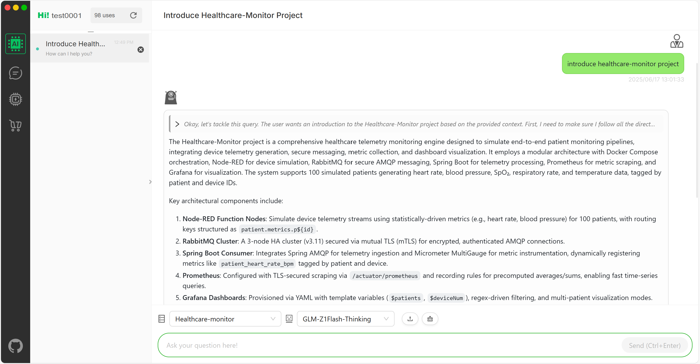

# 
AI Hub

### 
[Try Here](http://aihub.linst-yyds.top/)

AI Hub is a versatile platform designed with two primary modules: [AI-Chatbot](https://github.com/lst3455/AI-ChatBot)
and [AI-Agent](https://github.com/lst3455/AI-Agent). These distinct systems leverage the unique characteristics of
various intelligent agents to effectively manage and process complex tasks. Architecturally, AI Hub is a decoupled
front-end/back-end platform employing Domain-Driven Design (DDD) and a microservices approach. This robust structure
facilitates the delivery of generative AI services by integrating diverse large language models. The platform
predominantly utilizes the Spring AI SDK to ensure smooth and stable content generation. Currently, AI Hub supports a
range of models including the Qwen3 series, Deepseek-R1, Deepseek-v3, and ChatGLM-4-Flash, with ongoing efforts to
incorporate more models in the future.

At present, AI Hub's services interface with the [LuckWhirl Platform](https://github.com/lst3455/LuckWhirl-platform),
where users can gain access to its AI capabilities through a lottery-based system.

### Key Features:

1. **Authentication and Token Management**  
   The back end validates login verification codes and issues **JWT tokens** with defined expiration periods.  
   The front end securely stores the tokens to enable temporary login-free sessions.

2. **Spring AI Integration with multiple model options**  
   Using **Spring AI 1.0.0** to interface with models using a **session-based conversational model**.
    - **Session Management**: Leveraged **Guava** for storing session histories, ensuring efficient state management.
    - **Streaming Responses**: Use **Flux** to support dynamic, streamed responses.

3. **AI-Agent Development and RAG System Implementation**
    - Advanced to the first stage of **AI-Agent development**, featuring the successful implementation of a **Retrieval
      Augmented Generation (RAG)** system.
    - The RAG system is an intelligent system that combines retrieval and generation. It is designed to:
        - Rapidly extract relevant information from massive datasets.
        - Generate precise, coherent answers by leveraging contextual understanding.
    - This system utilizes **Redis** and **PostgreSQL** (as a vector database) and supports parsing various text types.
    - Building a proprietary RAG knowledge base with this system enables internet companies to offer users more
      personalized and professional services.

4. **Sensitive Content Management with Chain of Responsibility**  
   A **chain of responsibility pattern** is used for managing content filtration through whitelist checks and sensitive
   word filtering.
    - **Customizable Filtering**: Integrated the **sensitive-word filtering system** with adjustable filtering levels
      for diverse use cases.

5. **Inter-Service Communication with RPC**  
   Inter-service communication is facilitated through **Dubbo** for RPC interfaces, with **Nacos** as the service
   registry.
    - **Dynamic Integration**: Designed both **RPC** and **HTTP** callback interfaces to invoke external microservices.

### Key Technologies:

- **Frontend**:
    - React
    - TypeScript

- **Backend**:
    - Spring & SpringBoot
    - MyBatis & JDBC
    - JWT
    - Redis
    - Guava
    - MySQL & PostgreSQL
    - Dubbo
    - Nacos
    - Ollama
    - ChatGLM & DeepSeek & Qwen3
    - Retrofit2

- **DevOps**:
    - Git
    - Docker

- **Design Patterns and Architecture**:
    - DDD (Domain-Driven Design)
    - Factory Pattern, Strategy Pattern, Template Pattern, Composite Pattern

