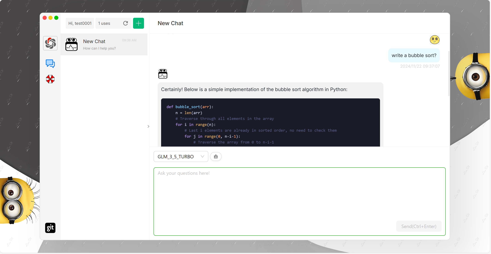

## 
AI-Chatbot

Try here: http://linst-yyds.top:3000

The project took more than half a year from requirement analysis, architecture learning, and design to coding implementation, and went through three versions of iterations.

---

authentication page

home page

---

**AI-ChatBot** is a decoupled front-end/back-end platform employing **Domain-Driven Design (DDD)** and a **microservices architecture** to deliver generative AI services by integrating various large language models. Currently, it interfaces with my another project **LuckWhirl Platform** (https://github.com/lst3455/LuckWhirl-platform) and is deployed on a **2-core, 8GB cloud server**.

---

### Key Features:

1. **Authentication and Token Management**  
   The back end validates login verification codes and issues **JWT tokens** with defined expiration periods.  
   The front end securely stores the tokens to enable temporary login-free sessions.

2. **Custom SDK Integration with ZHIPU GLM**  
   A custom SDK was developed to interface with the **ZHIPU GLM** model using a **session-based conversational model**.
  - **Session Management**: Leveraged **Guava** for storing session histories, ensuring efficient state management.
  - **Streaming Responses**: Implemented a **factory pattern** to support dynamic, streamed responses.

3. **Sensitive Content Management with Chain of Responsibility**  
   A **chain of responsibility pattern** is used for managing content filtration through whitelist checks and sensitive word filtering.
  - **Customizable Filtering**: Integrated the **sensitive-word filtering system** with adjustable filtering levels for diverse use cases.

4. **Inter-Service Communication with RPC**  
   Inter-service communication is facilitated through **Dubbo** for RPC interfaces, with **Nacos** as the service registry.
  - **Dynamic Integration**: Designed both **RPC** and **HTTP** callback interfaces to invoke external microservices.
---

### Key Technologies:

- **Frontend**:
   - React
   - TypeScript

- **Backend**:
   - Spring & SpringBoot
   - MyBatis
   - Guava
   - MySQL
   - Dubbo
   - Nacos
   - ChatGLM
   - Retrofit2

- **DevOps**:
   - Git
   - Docker

- **Design Patterns and Architecture**:
   - DDD (Domain-Driven Design)
   - Factory Pattern, Strategy Pattern, Template Pattern, Composite Pattern

---

